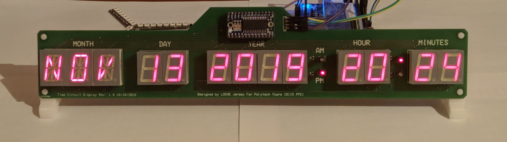

# Time Circuit Display Board 

This is my version of the famous Time Circuit Display showcased in **Back to the Future** movies.

This is a piece of electronics from the *De Lorean*.
This version is 32cm in width and 7cm in height.

*So definitely not the exact same as the movie but still a nice looking piece of electronic !*



You have the hardware files for **Multisim and Ultiboard** CAD software.

**PDF are provided for documentation of the design.**

Also, I made a Library to drive the display using a Linux ARM **I2C** from userspace.

It is available in the **sw/TimeCircuitDisplay** source files.

It used the **/dev/i2c-1** specified in the **ht16k33.c** file. It runs on DE0-Nano-Soc on the photo.

The program takes an argument which is the brightness of the display:
1. 0=Minimum brightness
2. 15=Maximum brightness

```
./TimeCircuitDisplay 15
```

